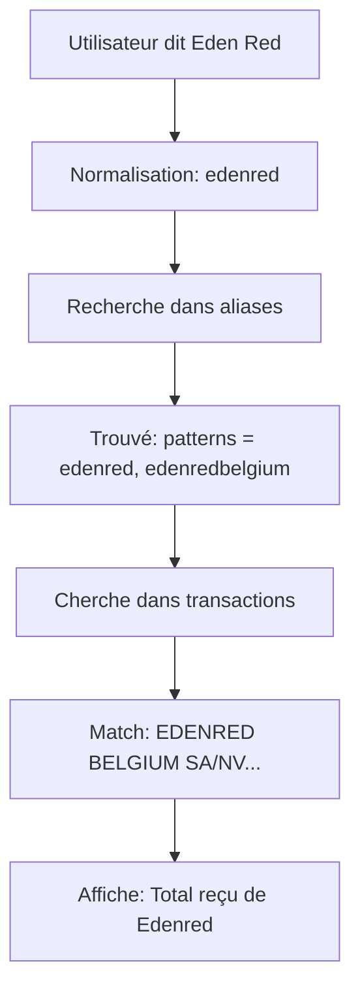

# 🎯 Système d'Aliases pour les Fournisseurs

## ✅ Ce qui a été implémenté

Le bot Telegram peut maintenant reconnaître **automatiquement** différentes variantes de noms de fournisseurs grâce à un **dictionnaire d'aliases**.

---

## 📊 Comment ça fonctionne ?

### Avant (❌)
```
Utilisateur: "Donne-moi les recettes du fournisseur Eden Red"
Bot: ❌ Aucune transaction trouvée pour "Eden Red"
```

### Après (✅)
```
Utilisateur: "Donne-moi les recettes du fournisseur Eden Red"
Bot: 
━━━━━━━━━━━━━━━━━━━━━━
🔍 TRANSACTIONS - EDENRED
━━━━━━━━━━━━━━━━━━━━━━
💵 Total reçu de Edenred: 2 387,86 €
```

---

## 🗂️ Fichiers créés

### 1. `supplier-aliases.json` (Configuration)
Dictionnaire des fournisseurs éditable sans recompilation.

### 2. `src/supplier-aliases.ts` (Code)
Logique de normalisation et matching.

### 3. Scripts utilitaires
- `add-supplier.ts` - Ajouter un fournisseur de manière interactive
- `list-suppliers.ts` - Lister tous les fournisseurs configurés
- `test-aliases.ts` - Tester le système d'aliases

### 4. Documentation
- `SUPPLIERS.md` - Guide complet de gestion des fournisseurs

---

## 🚀 Guide rapide

### Ajouter un nouveau fournisseur

```bash
# Méthode 1 : Interactive (recommandé)
npx ts-node add-supplier.ts

# Méthode 2 : Éditer directement supplier-aliases.json
nano supplier-aliases.json

# Redémarrer le bot
npm run build && pm2 restart billit-bot
```

### Lister les fournisseurs existants

```bash
npx ts-node list-suppliers.ts
```

### Tester le système

```bash
npx ts-node test-aliases.ts
```

---

## 📋 Fournisseurs préconfigurés

| Fournisseur | Aliases | Patterns |
|-------------|---------|----------|
| **Foster** | foster, foster fast food, foster fastfood | foster, fosterfastfood |
| **EDENRED** | edenred, eden red, eden, ticket restaurant | edenred, edenredbelgium |
| **Collibry** | collibry, colibri, collibri | collibry |

---

## 🔧 Architecture technique

### 1. Normalisation
Conversion du texte pour éliminer les variations :
- Minuscules
- Sans espaces
- Sans accents
- Sans ponctuation

### 2. Matching
```typescript
matchesSupplier(description, searchTerm)
  → Vérifie si la description contient un des patterns du fournisseur
```

### 3. Affichage
```typescript
getSupplierDisplayName(searchTerm)
  → Retourne le nom propre du fournisseur (ex: "Edenred")
```

---

## 📱 Exemples d'utilisation

### Toutes ces commandes fonctionnent maintenant :

**EDENRED :**
- "Donne-moi les recettes du fournisseur **Eden Red**"
- "Recettes **edenred** du mois"
- "Transactions **ticket restaurant**"

**Foster :**
- "Quel est le montant payé à **Foster** en octobre ?"
- "Transactions **foster fast food**"

**Collibry :**
- "Transactions **colibri**" (orthographe alternative acceptée)

---

## 🎓 Apprentissage automatique (Future)

### Version future possible :

1. Le bot détecte automatiquement les fournisseurs récurrents
2. Propose d'ajouter des aliases automatiquement
3. Apprend de vos corrections

Exemple :
```
Utilisateur: "Transactions Delhaize"
Bot: ❌ Aucune transaction trouvée
Bot: 💡 Voulez-vous que j'apprenne "Delhaize" ? (y/n)
```

---

## 🔍 Dépannage

### Problème : Le fournisseur n'est pas reconnu

**Solutions :**

1. Vérifier que le bot a été redémarré
```bash
pm2 restart billit-bot
```

2. Vérifier les logs
```bash
pm2 logs billit-bot
```

3. Tester la normalisation
```bash
npx ts-node test-aliases.ts
```

4. Vérifier les transactions réelles
```bash
npx ts-node test-edenred.ts
```

---

## 📈 Avantages du système

✅ **Flexible** - Ajout sans recompiler le code
✅ **Intelligent** - Normalisation avancée
✅ **Maintenable** - Fichier JSON simple
✅ **Extensible** - Facile d'ajouter de nouveaux fournisseurs
✅ **Testable** - Scripts de test inclus

---

## 🔄 Workflow complet



---

## 📞 Support

Pour plus d'informations, consultez :
- `SUPPLIERS.md` - Guide détaillé
- `test-aliases.ts` - Exemples de tests
- `src/supplier-aliases.ts` - Code source

---

**✅ Le système d'aliases est opérationnel et prêt à l'emploi !**
